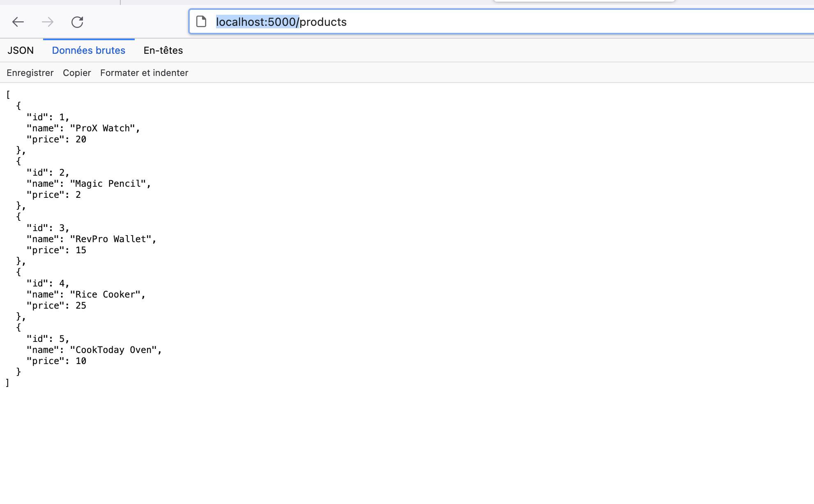
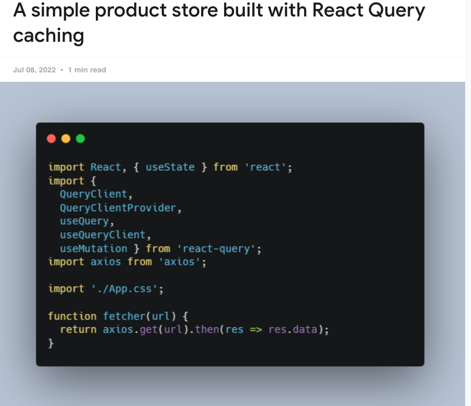
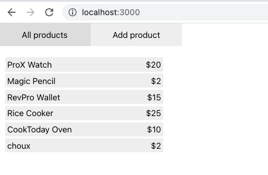
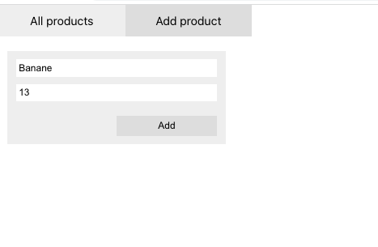

# A simple product store built with React Query caching

A simple product store built with React Query caching, fetching all product add prodct

# How to run the project?

Start the RESTful mock server (Requires json-server):
json-server --watch --port=5000 --delay=1000 db.json

# Screen shot

